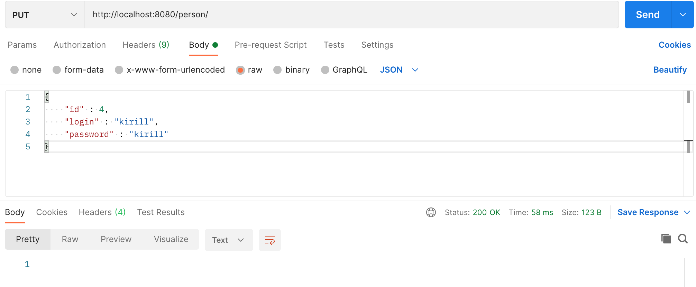
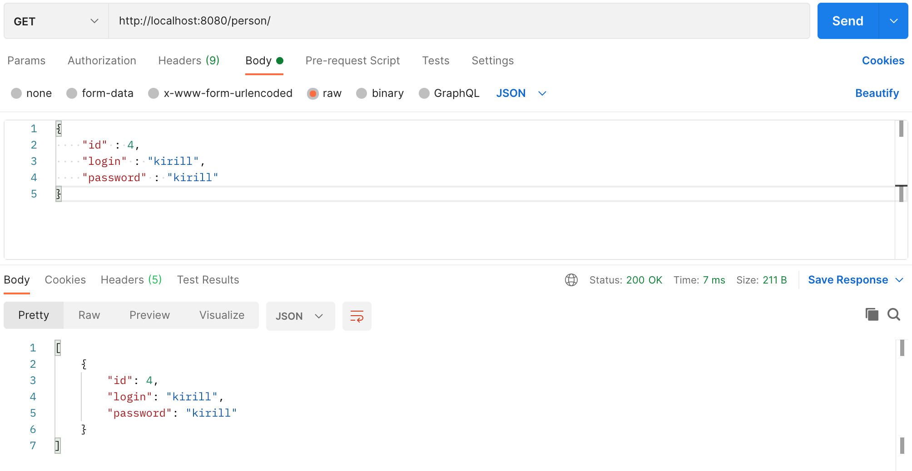
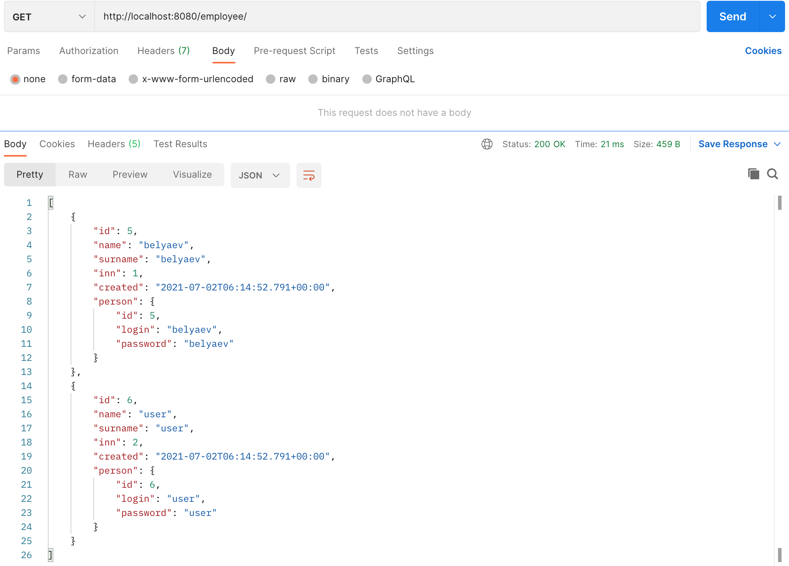
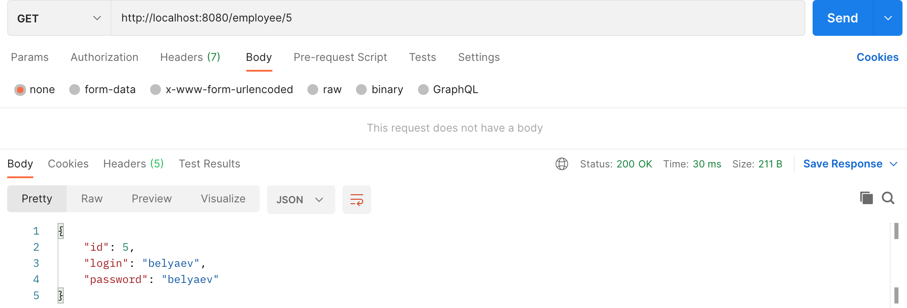
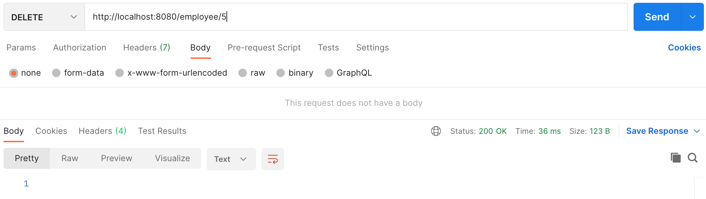

## Проект курса [job4j](http://job4j.ru)

### Rest

Приложение риализует создание/редактирование/удаление модели Person.

Технологии:
- PostgresSQL
- CRUDRepository
- Spring Boot / Security / Data / Rest
- Log4j
- JUnit / Mockito
- MVC / Singleton (On Demand Holder Idom)

Добавление пользователя http://localhost:8080/person/

Изменение пользователя по ID http://localhost:8080/person/

Получение всех пользователей http://localhost:8080/person/

Получение пользователя по ID http://localhost:8080/person/{id}

Удаление пользователя по ID http://localhost:8080/person/{id}

Через Rest можно добиться такого результата добавления пользователя http://localhost:8080/employee/

Изменения пользователя по ID http://localhost:8080/employee/

Получение всех работников http://localhost:8080/employee/

Получения пользователя по ID http://localhost:8080/employee/{id}

Удаление пользователя по ID http://localhost:8080/employee/{id}
